# ☕ Coffee Shop – React Landing Page

**Coffee Bliss** is a modern, responsive, and visually engaging landing page for a coffee shop or cafe, built using **React**. It features smooth scrolling, animated sections, and a clean, modular component structure.

## 🚀 Technologies Used

- ⚛️ React 19+
- 🎨 CSS Modules
- 📜 React Scroll (`react-scroll`)
- 🎥 Swiper for sliders
- 🌐 React Icons
- 📊 Fully component-based architecture

## 📁 Project Structure

```bash
src/
├── assets/                # Images and icons
├── components/            # Main UI components
│   ├── about/
│   ├── choose/
│   ├── features/
│   ├── footer/
│   ├── gallery/
│   ├── header/
│   ├── home/
│   ├── menu/
│   ├── offers/
│   ├── reservation/
│   ├── stats/
│   ├── team/
│   └── testimonials/
├── Data.js                # Centralized data file
├── App.js                 # Root component
└── index.js               # Entry point
````

## 🔧 Getting Started

1. **Clone the repository:**

```bash
git clone https://github.com/Adil-Bikiev/Coffee-shop.git
cd Coffee-shop
```

2. **Install dependencies:**

```bash
npm install
```

3. **Start the development server:**

```bash
npm start
```

Visit [http://localhost:3000](http://localhost:3000) to view the app in your browser.

## Screenshots


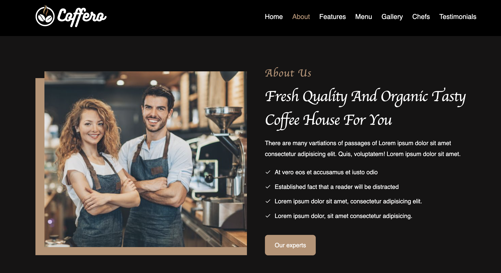
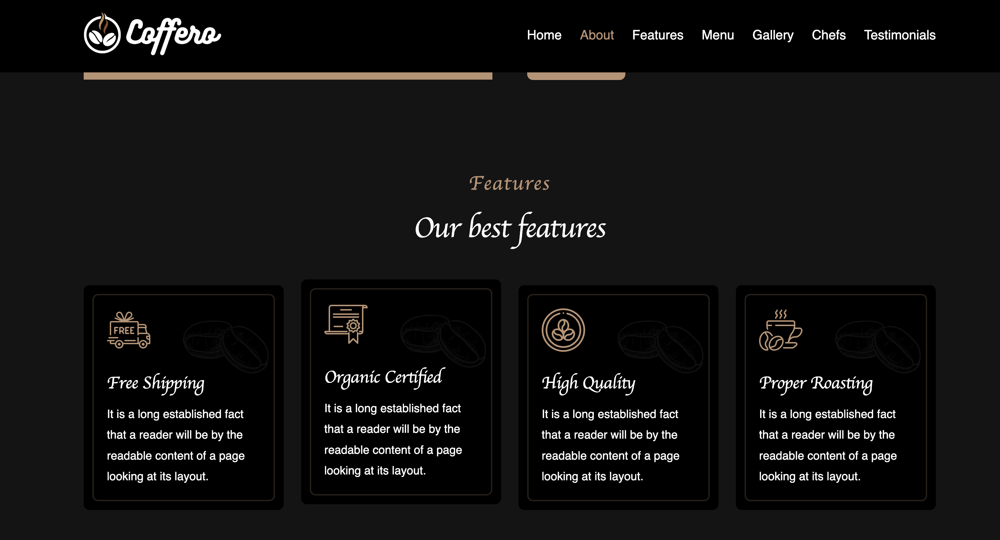
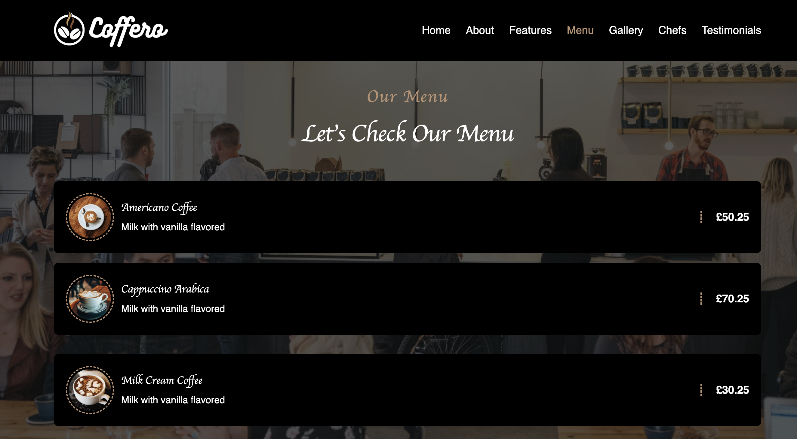
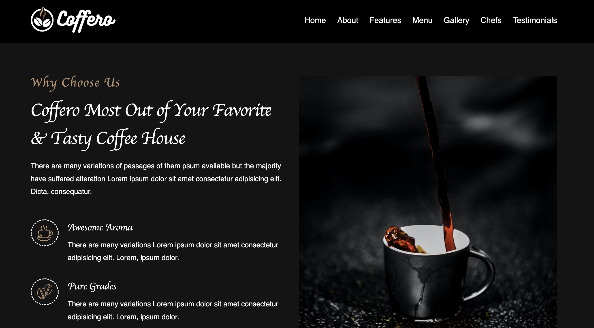
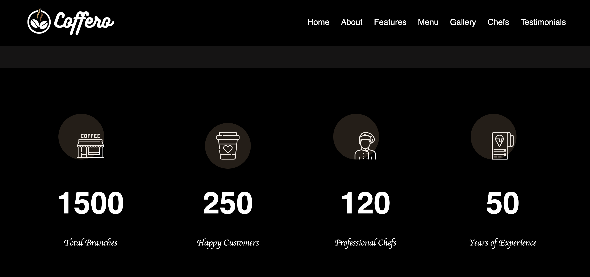
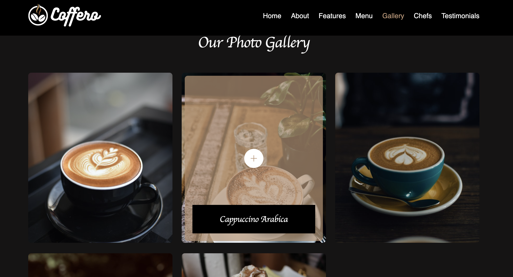
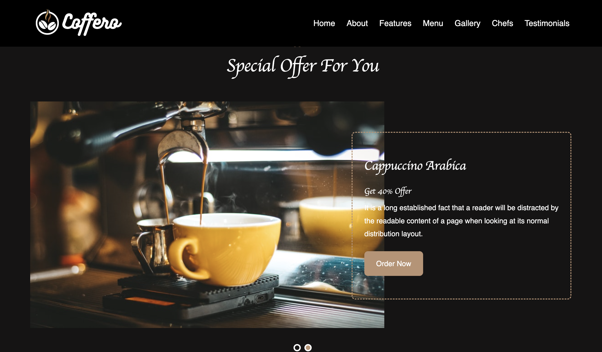
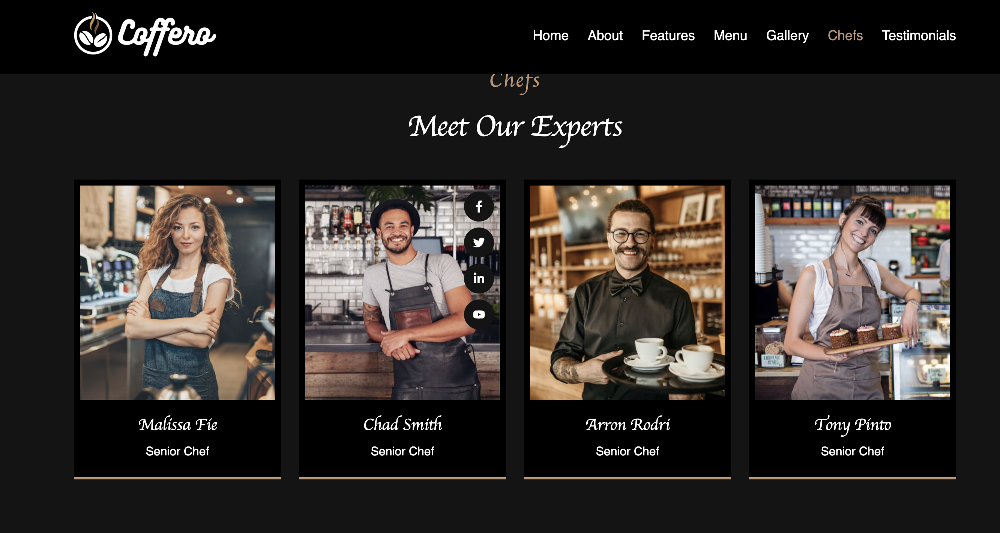
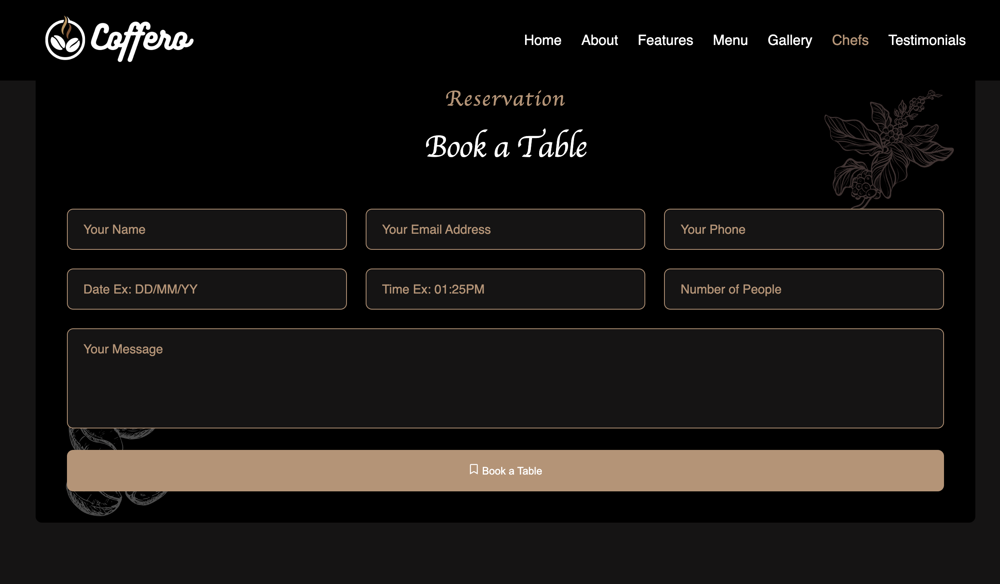
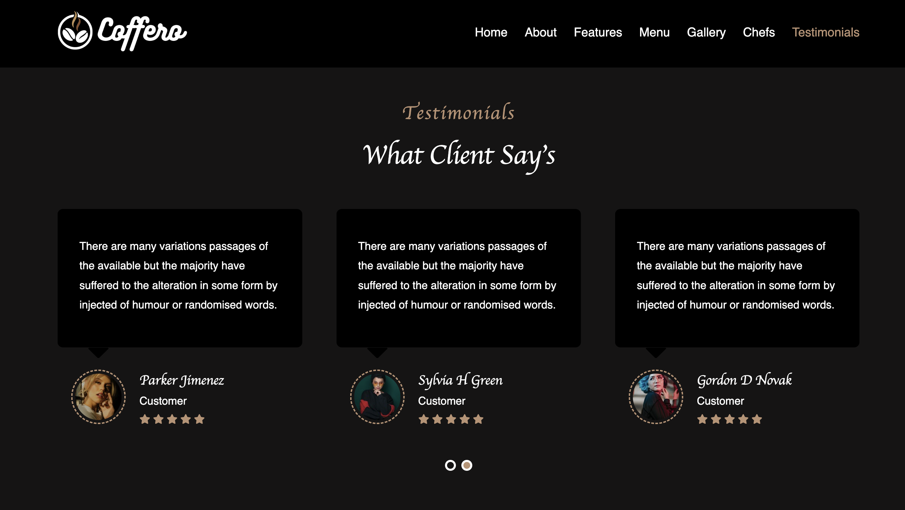
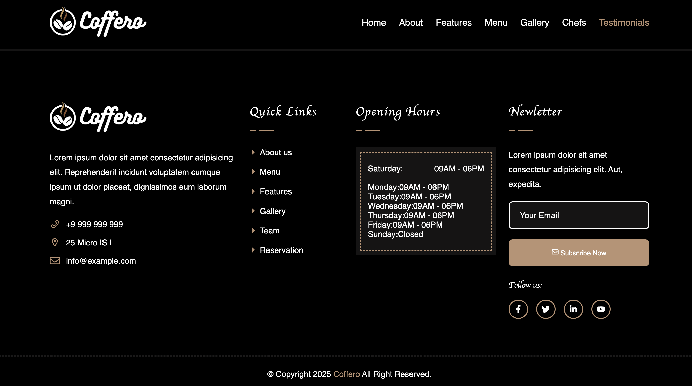
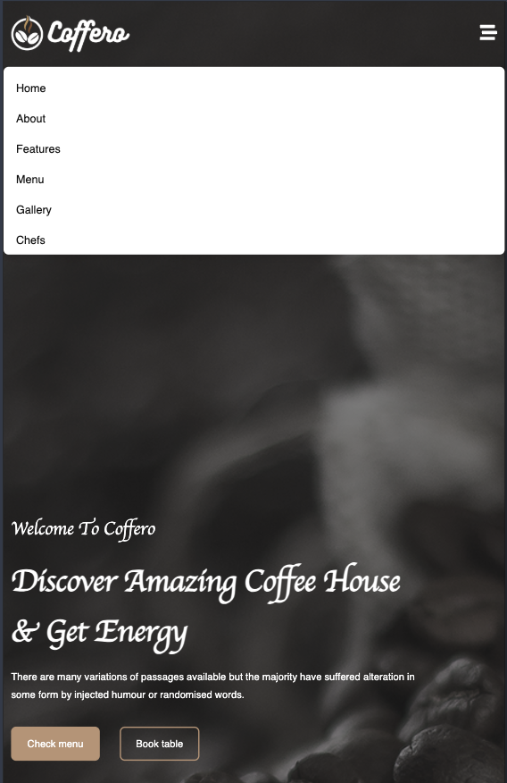


## 📦 Main Libraries

| Library        | Purpose                                     |
| -------------- | ------------------------------------------- |
| `react-icons`  | Icon library                                |
| `react-scroll` | Smooth scrolling navigation                 |
| `swiper`       | Responsive sliders for gallery/testimonials |
| `web-vitals`   | Performance monitoring                      |

## 🧩 Key Components

Each component is a standalone section of the landing page:

* `Header` — Sticky responsive navigation bar
* `Home` — Hero section with a call-to-action
* `About`, `Features`, `Menu`, `Choose` — Informational sections
* `Gallery`, `Team`, `Testimonials` — Visual and social proof
* `Reservation` — Booking form section
* `Footer` — Contact info and links

## ✨ Features

* Smooth anchor-based navigation
* Sticky header with scroll effects
* Fully responsive design
* Clean, modular structure
* Easily editable data via `Data.js`

## 🛠 Future Improvements

* Backend integration for reservation form (Node.js, Firebase, etc.)
* Google Maps API integration
* Internationalization (i18n support)
* Scroll animations (e.g., `AOS`, `Framer Motion`)

## 📄 License

This project is licensed under the MIT License — see the [LICENSE](./LICENSE) file for details.
